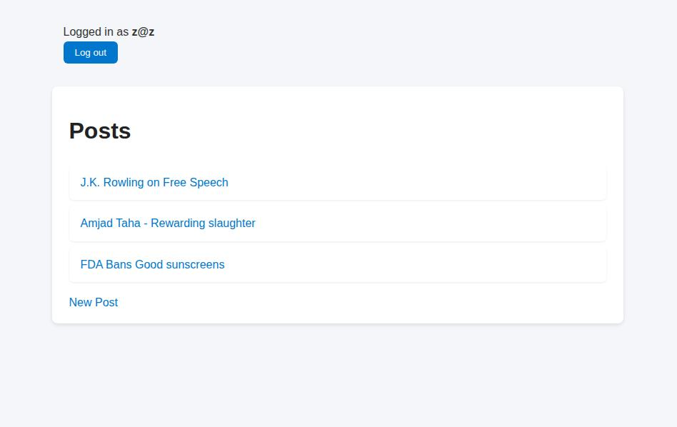
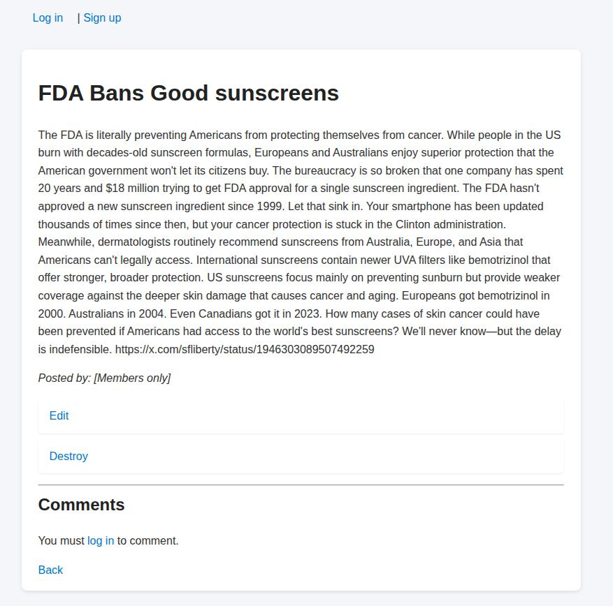
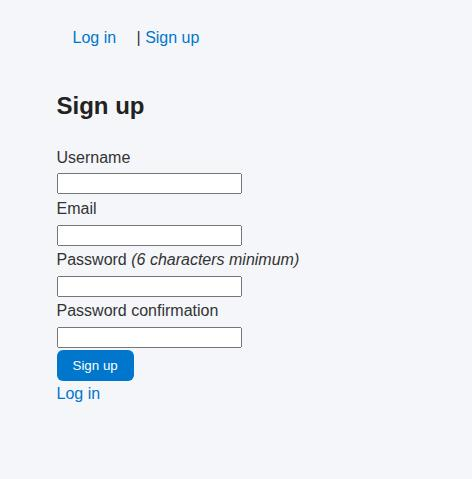

# Members Only

A simple Ruby on Rails application where only signed-in users can see post authors and add comments.  
Inspired by [The Odin Project](https://www.theodinproject.com/lessons/ruby-on-rails-members-only) assignment.

## 📝 Features

- User authentication with Devise  
- Users can create posts and comment  
- Non-logged users can see posts, but authors and comments are hidden  
- Clean navbar updates based on sign-in state

## 📸 Screenshots

### 🏠 Index Page

### ✍️ Logged-in Post View

### 🚪 Member (Logged-out) Post View

### 📝 Sign Up Page
